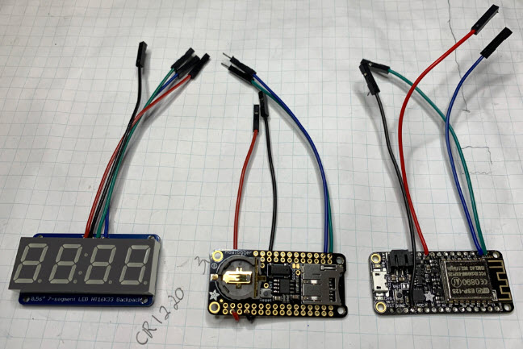

# BugClock

https://hackaday.com/2019/11/21/circuitpython-sculpture-clock-adds-character-to-any-desk/

# Parts

Brass Rods: (from the hackaday project) 
https://www.amazon.com/gp/product/B001APJ0OG

RTC: (from the hackaday project) 
https://www.adafruit.com/product/2922

Adafruit Feather (Huzzah): 
https://www.adafruit.com/product/2821

Display Backpack: 
https://www.adafruit.com/product/877

# Capacitive Touch

https://learn.adafruit.com/sensor-plotting-with-mu-and-circuitpython/capacitive-touch

https://forums.adafruit.com/viewtopic.php?f=8&t=91655

# RTC

PCF8523 I2C address: 0x68

https://www.nxp.com/docs/en/data-sheet/PCF8523.pdf

# Display

HT16K33 I2C address: 0x70

# Testing the components (Raspberry Pi)

Temporary wires for testing: 

