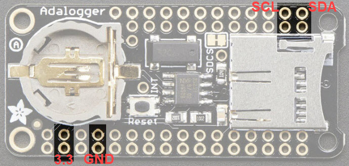

# BugClock

https://hackaday.com/2019/11/21/circuitpython-sculpture-clock-adds-character-to-any-desk/

# Parts

Brass Rods: (from the hackaday project)<br>
https://www.amazon.com/gp/product/B001APJ0OG

RTC: (from the hackaday project)<br>
https://www.adafruit.com/product/2922

Adafruit ItsyBitsy M0 Express: (from the hackaday project)<br>
https://www.adafruit.com/product/3727

Display Backpack: (from the hackaday project)<br>
https://www.adafruit.com/product/877

# RTC

PCF8523 I2C address: 0x68

https://www.nxp.com/docs/en/data-sheet/PCF8523.pdf



# Display

HT16K33 I2C address: 0x70

# Testing the components (Raspberry Pi)

Temporary wires for testing:<br>


```
i2cdetect -y 1
```